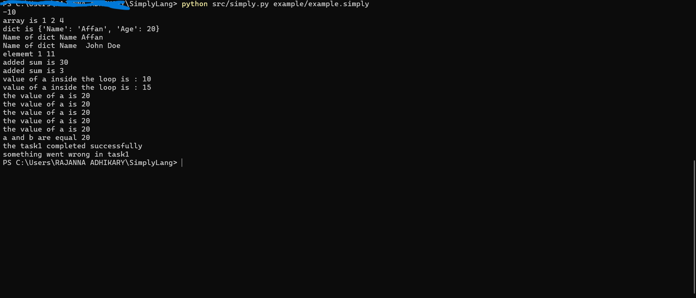

#  Simple Language - SimplyLang

Welcome to the **SimplyLang** language project! SimplyLang is a programming language crafted to make learning to code accessible and enjoyable for young learners. Its design emphasizes easy-to-understand syntax and natural language constructs.

## 📝 Overview

**SimplyLang** provides a friendly introduction to programming by using natural language commands and straightforward syntax. It is designed to help children grasp fundamental programming concepts while having fun.

<!-- Add a colorful logo or banner -->
<p align="center">
  
</p>


---

## ✨ Sample Code + Output
*Code:*
```bash
array is 1 , 2 , 4 
Note: prinitng .

show("array is " , array)
```
*Output:*
```bash
array is 1 2 4
```
---
## 📸 Example Output

<p align="center">
  
</p>

(Yes, it’s really that simple!) 😄


###  Key Features

- **Intuitive Syntax**: Uses natural language to make coding easy for children.
- **Interactive Feedback**: Allows learners to see the results of their code instantly.
- **Educational Focus**: Aims to teach basic programming concepts in an engaging way.

---
## 📚 Learning Resources

Explore these additional resources to learn more about SimplyLang:

- **[SimplyLang DeepWiki](https://deepwiki.com/AffanShaikhsurab/SimplyLang)** - Comprehensive documentation and community-contributed examples

- [Official Syntax Notes](./SYNTAX_NOTES.md) - Quick reference for all commands


---

## 🛠️Installation Guide

### Prerequisites

- **Windows Operating System**: The installer is designed for Windows.
- **Administrative Rights**: Required to install the application and modify system environment variables.

###  Installation Steps

1. **⬇Download the Installer**

   Obtain the SimplyLang Language  installer (`SimplyLang.exe`) from the [official website](https://simplylang.org/) or your distribution channel.

2. **Run the Installer**

   - Double-click the `SimplyLang.exe` file to start the installation process.
   - Follow the on-screen instructions to complete the installation. The installer will:

     -  Install the SimplyLang language executable and Python.
     
     -  Set up necessary environment variables to run SimplyLang from the command line.

3. **Verify Installation**

   - The installer will automatically add SimplyLang to your system's PATH.
   - Open Command Prompt and type `SimplyLang` to ensure the executable is recognized and runs correctly.

### Example Usage

1. **Open Command Prompt**

   Press `Win + R`, type `cmd`, and press Enter to open Command Prompt.

2. **Run a SimplyLang Script**

   Navigate to the directory where your `.SimplyLang` file is located or simply execute:

   ```bash
   SimplyLang example.SimplyLang
   ```

   Replace `example.SimplyLang` with the name of your SimplyLang language file.

3. **Create and Run a SimplyLang Script**

   Create a `.SimplyLang` file with the following content:

   ```SimplyLang
   a is 1
   b is a + 10
   show(b)
   ```

   Save the file as `example.SimplyLang` and run it using the command above to see the result.

---

## 📂 Project Structure:
```
SimplyLang/
├── .github/                     # GitHub-specific configurations and workflows
├── assets/                      # Project assets (logo, output screenshots, etc.)
│   ├── logo.png
│   └── output.png
├── builder/                     # Build-related files and scripts
├── docs/                        # Documentation files
├── example/                     # Example SimplyLang programs
├── src/                         # Source code for the SimplyLang interpreter
├── tests/                       # Test files
├── website/                     # Website-related files
├── .gitignore                   # Git ignore file
├── CODE_OF_CONDUCT.md           # Contributor code of conduct
├── CONTRIBUTING.md              # Contribution guidelines
├── LICENSE                      # License file
├── README.md                    # Project README file
├── ROADMAP.md                   # Future roadmap for the project
├── SYNTAX_NOTES.md               # Syntax notes for learning SimplyLang
├── building_instructions.md     # Build instructions
├── log.txt
├── requirements.txt             # Python dependencies
└── todo.md                      # To-do list for the project
```
---
## 🎯Project Goals

The SimplyLang language project aims to:

- **Make Programming Accessible for Young Learners**: By using natural language constructs, SimplyLang helps children understand and write code more easily.
  
- **Promote Early Learning**: Designed to be engaging and interactive, SimplyLang encourages children to explore and learn programming concepts through hands-on experience.

- **Develop Computational Thinking**: Introduces programming logic and problem-solving in a way that is approachable and fun.

- **Create an Intuitive Development Environment**: With its easy-to-read syntax and immediate feedback, SimplyLang aims to provide a supportive learning environment.

---
## 🤝Contributing

We welcome contributions to the SimplyLang project! If you’d like to contribute:

1. Fork the repository on GitHub.
2. Create a new branch for your changes.
3. Submit a pull request with a description of your changes.

---
## 🆘Support

For support or questions, please contact us at [affanshaikhsurabofficial@gmail.com](mailto:affanshaikhsurabofficial@gmail.com) or visit our [support page](#).

---
## 📄 License

This project is licensed under the MIT License - see the [LICENSE](LICENSE) file for details.
